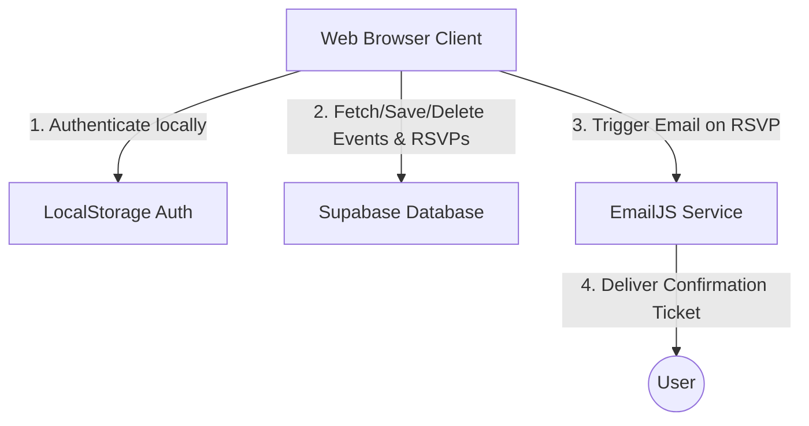

# Updated Supabase & Email Integration Plan

Based on your preferences, we will:
1. **Keep the current LocalStorage authentication system** (no migration to Supabase Auth is required).
2. **Migrate Events and RSVPs** to the Supabase PostgreSQL database.
3. **Use EmailJS** to send email confirmations directly from the browser client safely and easily.
4. **Implement Event Deletion**:
   - **Committee Members** can delete their own events (with automatic cascade deletion of associated RSVPs).
   - **Admins** can delete any event globally.

---

## 1. Simplified Architecture



---

## 2. Supabase Setup Guide

Follow these steps to set up your database:

### Step 1: Create a Supabase Project
1. Go to [supabase.com](https://supabase.com) and sign in.
2. Click **New Project** and select your organization.
3. Fill in the project details:
   - **Name**: `UNIEvent-Management`
   - **Database Password**: *(Generate a strong password and save it somewhere)*
   - **Region**: Select the region closest to you (e.g., Singapore or US East).
4. Click **Create new project** and wait a few minutes for it to provision.

### Step 2: Initialize Database Tables
1. In your Supabase dashboard, click the **SQL Editor** icon in the left sidebar (looks like `>_`).
2. Click **New query**.
3. Paste the SQL script below and click **Run**:

```sql
-- 1. Create Events Table
create table public.events (
  id text primary key, -- Keep text ID to match current app structure
  title text not null,
  category text not null,
  description text not null,
  event_date date not null,
  start_time time not null,
  end_time time not null,
  venue text not null,
  image_url text,
  requested_by text not null,
  requested_by_name text not null,
  status text not null default 'pending' check (status in ('pending', 'approved', 'rejected')),
  scorun integer not null default 0,
  location_type text not null check (location_type in ('physical', 'online')),
  platform text,
  reject_reason text,
  registrations integer not null default 0,
  created_at timestamp with time zone default timezone('utc'::text, now()) not null
);

-- 2. Create RSVPs Table (with ON DELETE CASCADE so deleting an event automatically clears registrations)
create table public.rsvps (
  id uuid default gen_random_uuid() primary key,
  event_id text references public.events(id) on delete cascade not null,
  user_id text not null,
  email text not null,
  created_at timestamp with time zone default timezone('utc'::text, now()) not null,
  unique (event_id, user_id)
);

-- Enable full access for the client-side API key (Disable RLS for prototype simplicity)
alter table public.events disable row level security;
alter table public.rsvps disable row level security;
```

### Step 3: Get your API Credentials
1. Click the **Project Settings** icon (gear symbol at the bottom-left of the sidebar).
2. Go to **API**.
3. Copy your:
   - **Project URL** (under Project API keys)
   - **API Key** (the `anon` / `public` key)

---

## 3. EmailJS Setup Guide (Easiest Email Service)

EmailJS allows you to send emails directly from the browser without running any server-side code or edge functions. It is secure because it doesn't expose secret API keys on the frontend.

### Step 1: Create an Account
1. Go to [emailjs.com](https://www.emailjs.com/) and sign up for a free account.

### Step 2: Connect your Email Service
1. In the EmailJS dashboard, click **Add New Service**.
2. Select your email provider (e.g., **Gmail** or **Outlook**).
3. Connect your account and click **Create Service**.
4. Note your **Service ID** (e.g., `service_xxxxxx`).

### Step 3: Create an Email Template
1. Go to **Email Templates** in the sidebar and click **Create New Template**.
2. Design your template using double-curly braces `{}` for dynamic values. For example:
   ```html
   <h2>Hello {{user_name}},</h2>
   <p>Your spot for <strong>{{event_title}}</strong> has been successfully confirmed!</p>
   <div style="border: 1px solid #E5E7EB; padding: 15px; border-radius: 8px; background: #FAFAF8;">
     <h4>🎟️ Ticket Details</h4>
     <p><strong>Date:</strong> {{event_date}}</p>
     <p><strong>Time:</strong> {{event_time}}</p>
     <p><strong>Venue:</strong> {{event_venue}}</p>
     <p><strong>SCORUN points:</strong> {{event_scorun}} pts</p>
   </div>
   <p>We look forward to seeing you there!</p>
   ```
3. In the **To Email** field in the template settings, set it to `{{to_email}}`.
4. Click **Save**. Note your **Template ID** (e.g., `template_xxxxxx`).

### Step 4: Get your Public Key
1. Go to **Account** -> **API Keys** in the sidebar.
2. Note your **Public Key** (e.g., `user_xxxxxx` or a random string).

---

## 4. Deletion Feature Implementation

We will add the following deletion behaviors:

### A. Database Cascade Deletion
By setting `on delete cascade` on the `rsvps` table's foreign key (`event_id`), deleting an event from the `events` table will automatically delete all RSVPs linked to that event.

### B. UI Deletion Controls
1. **Committee ("My Events" View)**: 
   - A trash bin button will be added to each card.
   - It will only trigger if the event belongs to the logged-in committee member.
2. **Admin ("Admin Dashboard" & "Event Details" View)**:
   - A global delete action will be available for any event.
3. **Confirmation Dialog**:
   - Both roles will be prompted with a confirmation popup ("Are you sure you want to delete this event?") before the operation completes.
